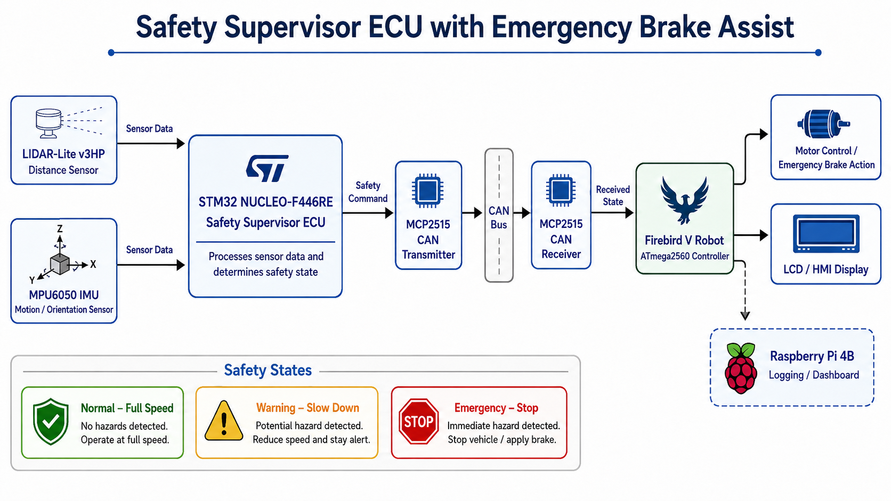
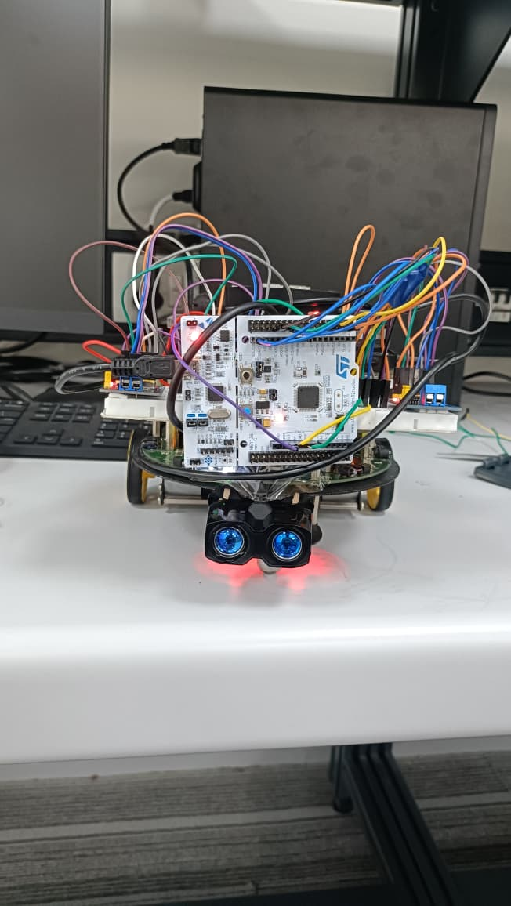
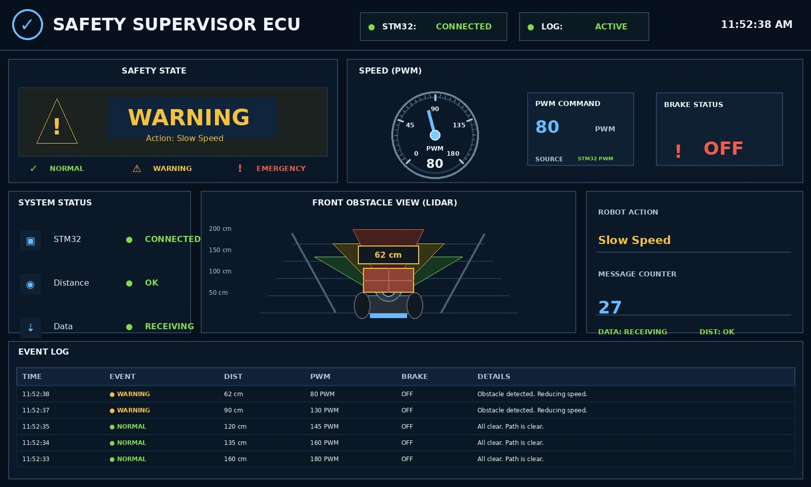

# Safety Supervisor ECU with Emergency Brake Assist

## Project Overview

This project is a prototype of a **Safety Supervisor ECU** designed to improve vehicle safety by detecting obstacles and controlling vehicle movement based on safety conditions.

The system uses distance and motion sensor data to identify dangerous situations and sends control commands through CAN communication. Based on the detected condition, the robot works in three safety states: **Normal**, **Warning**, and **Emergency**.

This project was implemented using an STM32 microcontroller, LIDAR sensor, IMU sensor, MCP2515 CAN modules, and FireBird V Robot.

---

## Objectives

* Detect obstacles in front of the vehicle using a LIDAR sensor.
* Monitor movement-related data using an IMU sensor.
* Classify the vehicle condition into Normal, Warning, or Emergency state.
* Send safety commands from STM32 to FireBird V Robot using CAN communication.
* Control the robot speed based on the safety state.
* Display the current state on the FireBird V Robot LCD.

---

## System Architecture

The system has two main sections:

### 1. Safety Supervisor ECU Side

The STM32 microcontroller acts as the main ECU. It collects sensor data from:

- LIDAR-Lite sensor for distance measurement
- MPU6050 IMU sensor for motion-related data

After processing the sensor values, STM32 decides the safety condition and sends the command through CAN communication.

### 2. Robot Control Side

The FireBird V Robot receives the CAN message using the MCP2515 CAN module. Based on the received safety command, it controls the robot motors and displays the safety state on the LCD.

## Components Used

* STM32 NUCLEO-F446RE Microcontroller
* FireBird V Robot
* LIDAR-Lite Distance Sensor
* MPU6050 IMU Sensor
* MCP2515 CAN Modules
* TJA1050 CAN Transceiver
* Raspberry Pi 4B with touch display
* Jumper Wires
* Power Supply / Battery

---
## Hardware Setup

## Working Principle

The system continuously reads obstacle distance using the LIDAR sensor. According to the distance value, the safety state is selected.

| State | Condition | Robot Action |
|---|---|---|
| Normal | Safe distance | Robot moves at normal speed |
| Warning | Obstacle detected at medium distance | Robot slows down |
| Emergency | Obstacle detected very close | Robot stops immediately |

The STM32 sends the selected safety state to the FireBird V Robot through CAN communication. The FireBird V Robot receives this data and performs the required action.

---

## Safety States

### Normal State

In this state, no obstacle is present in the danger zone. The robot continues moving normally.

### Warning State

In this state, an obstacle is detected within the warning range. The robot reduces its speed to avoid sudden collision.

### Emergency State

In this state, an obstacle is detected very close to the robot. The robot immediately stops to prevent collision.

---

## CAN Communication

CAN communication is used between STM32 and FireBird V Robot for reliable data transfer.

The MCP2515 CAN modules are connected on both sides. STM32 sends the safety command, and FireBird V receives the command and controls the robot accordingly.

### CAN Message Example

| Data | Meaning |
|---|---|
| 0 | Normal State |
| 1 | Warning State |
| 2 | Emergency State |
---

## Repository Structure

| Folder/File | Description |
|---|---|
| `src/stm32_ecu/` | STM32 Safety Supervisor ECU code |
| `src/firebird_v_robot/` | FireBird V Robot CAN receiver and motor control code |
| `docs/` | Report, presentation, pin connections, architecture, and testing results |
| `images/` | Project images, block diagram, hardware setup, and dashboard |
| `LICENSE` | MIT License |

## Software Tools Used

* STM32CubeIDE
* Arduino IDE
* Atmel Studio / Microchip Studio
* Embedded C
* Serial Monitor / RealTerm for debugging

---

## Project Features

* Real-time obstacle detection
* Three-level safety decision logic
* CAN-based communication
* Emergency brake assist logic
* LCD-based safety state display
* Robot speed control according to safety condition
* Hardware-level implementation using real sensors and robot platform

---
## Raspberry Pi Dashboard

## How to Run

### STM32 ECU Code

1. Open the STM32 ECU code from `src/stm32_ecu/`.
2. Open the project/code in STM32CubeIDE or Arduino IDE, depending on the file used.
3. Connect the LIDAR, IMU, and MCP2515 CAN module as per the pin connection document.
4. Upload the code to the STM32 board.

### FireBird V Robot Code

1. Open the FireBird V Robot code from `src/firebird_v_robot/`.
2. Open it in Atmel Studio / Microchip Studio.
3. Connect the MCP2515 CAN module to the FireBird V Robot using SPI.
4. Upload the code to the ATmega2560 controller.
5. Power the robot and check the LCD state output.

### Raspberry Pi Dashboard

1. Open the dashboard code if available.
2. Run the Python file on Raspberry Pi.
3. Use the dashboard for logging and visual monitoring.

## Applications

* Automotive safety systems
* Emergency braking systems
* Advanced Driver Assistance Systems
* Autonomous robot safety
* Embedded system communication projects
* CAN-based vehicle control systems

---

## Future Scope

* Add more sensors for better obstacle detection.
* Improve braking logic using speed and acceleration data.
* Add Raspberry Pi dashboard for real-time logging and visualization.
* Store sensor data for validation and testing.
* Implement more realistic road scenarios.
* Integrate camera-based object detection.

---

## Team Members

* Om Raut
* Uzair Shaikh
* Sahil Deshmukh

---

## Guide

Under the guidance of **Isheet Patel**

---

## Conclusion

The Safety Supervisor ECU project successfully demonstrates a basic emergency brake assist system using embedded hardware and CAN communication. The system detects obstacles, decides the safety condition, sends commands through CAN, and controls the robot according to the received state.

This project provides a practical understanding of embedded systems, sensor interfacing, CAN communication, and vehicle safety logic.
